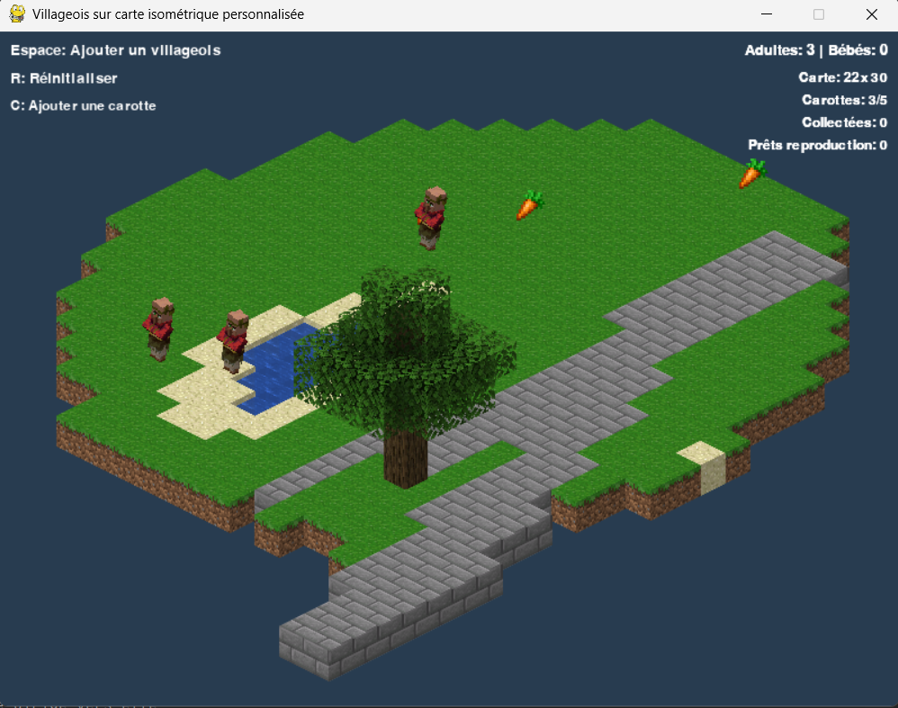

# 🏡 Village Simulator


  
  

---

## 📝 Project Description  
🧑‍🌾This project is a **sandbox village life simulator** built with Pygame.  
Villagers wander, eat carrots, reproduce, and grow over time.  

It’s a mix between a **tiny ecosystem** and a **genetic playground**.  
Carrots spawn randomly, villagers collect them to feed babies, and new villagers appear when couples meet.  

The simulation includes visual feedback with particles❤️, trees🌳, and isometric-style rendering🔷.  

---

## ⚙️ Features
  👣 Villagers that **move randomly** and interact with the environment  

  🥕 Carrots spawn on the map and are collected as food  

  🍼 Reproduction: villagers can create babies that grow into adults after eating  

  🌳 Trees and static obstacles rendered with an isometric-like depth system  

  ✨ Particle effects when villagers reproduce  

  🎨 Fallback graphics (rectangles) if image files are missing  

---

## 🎮 Example Screenshots  
Here’s a preview of the simulation:  

  

---

## ⚙️ How it works  
  🧑‍🤝‍🧑 Each villager is an independent entity with position, inventory, and state (adult or baby).  

  🥕 Carrots spawn randomly across the map. Villagers pick them up when colliding.  

  🍼 Babies consume carrots to grow into adults.  

  💞 When two villagers meet, they can create a new baby villager.  

  ✨ Visual particles show reproduction events.  

  🌳 Trees and water tiles are obstacles placed directly from the map file.  

---

## 🗺️ Schema  
💡 The simulation works on a **grid-based map** defined by a simple text file (`map.txt`):  

- `#` → solid block  
- `~` → water  
- `T` → tree  
- `.` → grass  

The map is loaded at startup and drawn with depth layering to keep visuals consistent.  

---

## 📂 Repository structure  
```bash
├── img/            # All images used on the code and the README
│
├── map.txt         # We can change the configuration of the map easily : Add Trees, change the forme or the block,...
├── village.py
│
├── LICENSE
├── README.md
```

---

## 💻 Run it on Your PC  
Clone the repository and install dependencies:  
```bash
git clone https://github.com/Thibault-GAREL/human_sandbox.git
cd human_sandbox

python -m venv .venv # if you don't have a virtual environment
source .venv/bin/activate   # Linux / macOS
.venv\Scripts\activate      # Windows

pip install pygame

python main.py
```

---

## 📖 Inspiration / Sources  
The idea is to have a solid base for natural selection for futur project !  

I was inspired by the video of [Code BH - J'ai codé une simulation pour comprendre l'égoïsme.](https://www.youtube.com/watch?v=qVOjXQUzOJw)

😆 100% coded by myself, no tutorials!
